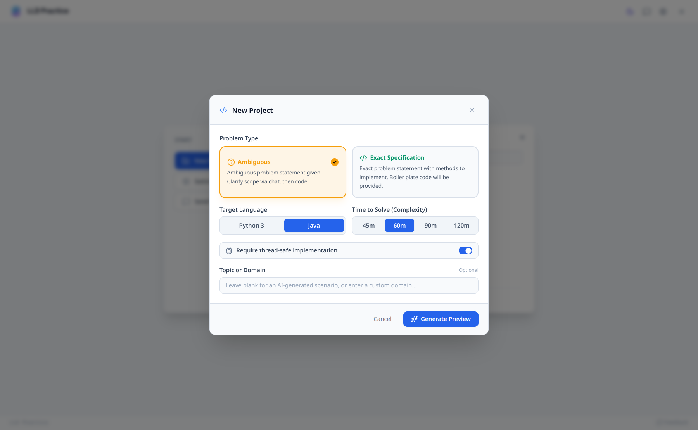
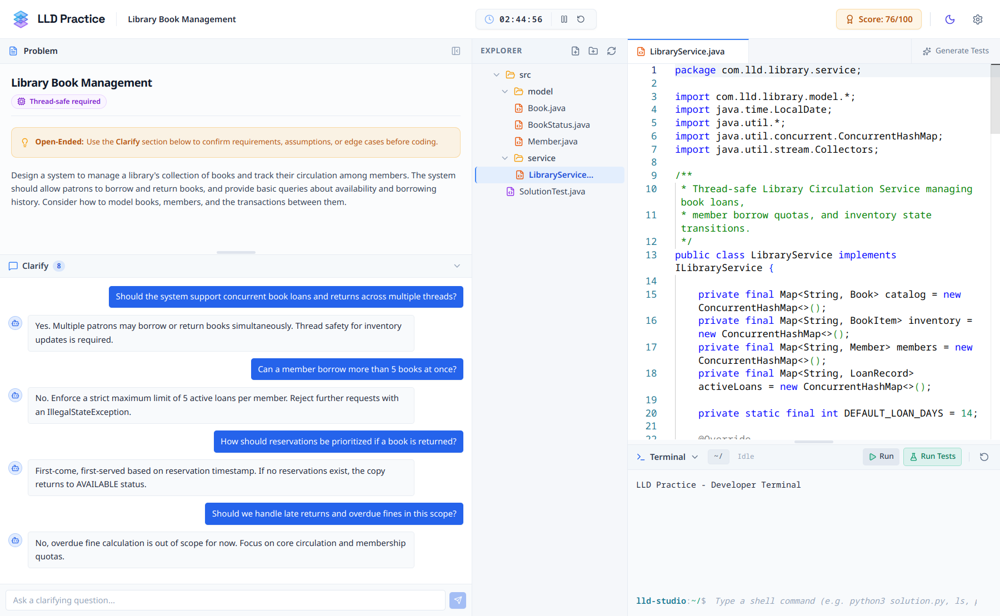
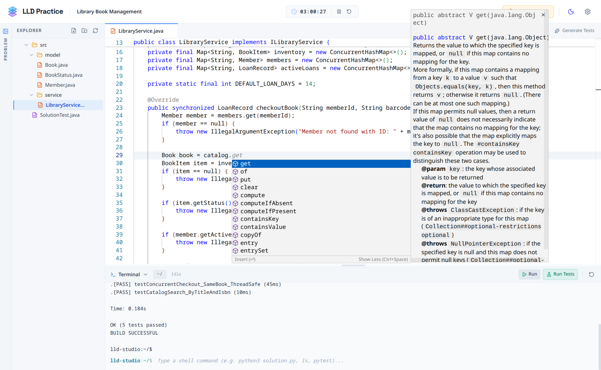
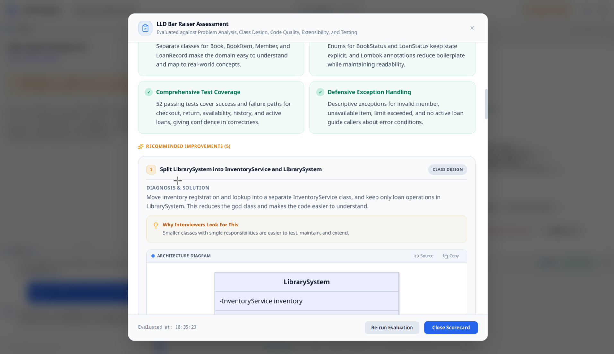
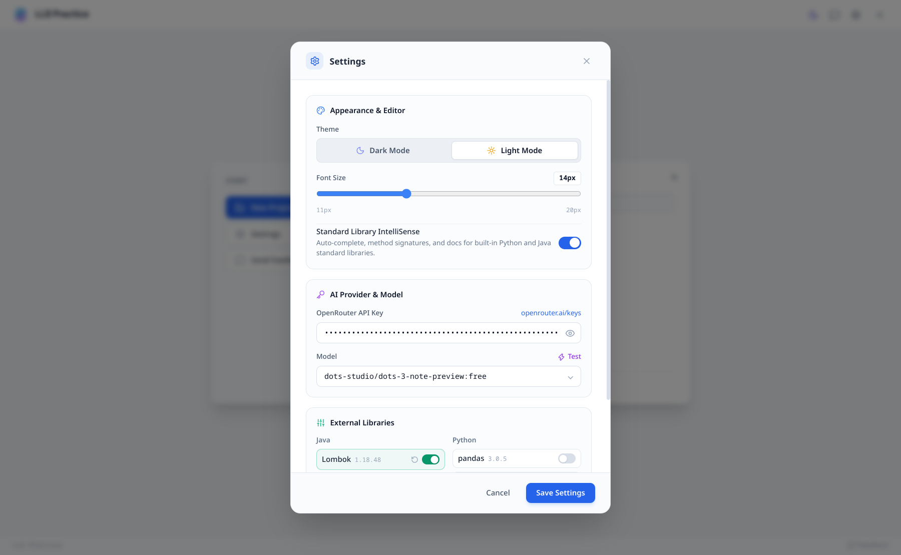

<p align="center">
  
</p>

<h1 align="center">LowLevelDesign.ai</h1>

<p align="center">
  <strong>AI-powered low-level design mock interviewer.<br/>Code. Explain. Get scored — completely free.</strong>
</p>

<p align="center">
  <a href="https://ccd97.github.io/LowLevelDesign.ai/">↓ Download & setup</a>
</p>

<p align="center">
  
  
  
  
</p>

---

An Electron desktop app for low-level design interview practice. An AI generates realistic problems, you design and code the classes, and an AI judge scores your performance.

**Use it 100% free (unlimited)** with free models on OpenRouter. No subscriptions, no sign-ups beyond the API key.

---

## Features

### 🎲 AI Interview Question Generator

One-click generation of realistic LLD interview questions across diverse domains, design patterns, and system architectures.

Pick Ambiguous mode for open-ended scenarios that need clarifying questions, or Detailed mode for fully specified method contracts. Each question is scoped to your time budget (45 / 60 / 90 / 120 min) in Python or Java.

You can add a topic or custom prompt to steer the question in a specific direction, or add a concurrency requirement for thread-safety practice.

<p align="center">
  
  <br/><sub>Configure problem mode, language, time budget, and concurrency requirements</sub>
</p>

---

### 🤖 AI Interviewer Chatbot

A simulated interviewer that sits alongside your problem statement in a chat panel. It behaves like a real interviewer — answers scope and edge-case questions with concrete rules, but **never gives away the solution**.

> *"Can a small package go into a large compartment?"* → *"For now, match the size exactly. If there's no matching compartment, reject the deposit."*
>
> *"Do we need thread-safety?"* → *"No, assume single-threaded usage. Thread-safety is out of scope."*
>
> *"Should I use a dict or a list?"* → *"That's a design decision for you to make. What trade-offs are you considering?"*

The full conversation is saved as part of your session.

<p align="center">
  
  <br/><sub>AI interviewer chat — ask clarifying questions just like a real interview</sub>
</p>

---

### 💻 Code Workspace with Run & Terminal

Write and run real code. The workspace is a multi-file code editor with file explorer, tabs, and auto-save:

- **Run & test** — real local execution with Python and Java, streamed output and pass/fail status
- **Interactive terminal** — per-session workspace on disk with full shell access
- **Session timer** — time budget with time-spent tracking

External libraries can be enabled per session.

<p align="center">
  
  <br/><sub>Code workspace with IntelliSense autocomplete, documentation flyout, and terminal test runner</sub>
</p>

---

### 🧪 AI Test Generation

One-click generation of runnable tests from your actual classes. Tests cover every required method including edge cases. Sessions with concurrency enabled get one extra multi-threaded check.

---

### ⚖️ AI Judge & Scoring

Open any session and run the **AI Judge** to get a detailed evaluation report. The judge analyzes your code, clarifications, and test output — and scores you across **6 dimensions**:

| Dimension | What it evaluates |
|---|---|
| **Problem Analysis** | Did you model the right entities and responsibilities? |
| **Class Design** | Are classes clean and well-organized? |
| **Code Quality** | Is the code readable and encapsulated? |
| **Extensibility** | Can new rules be added without rewriting? |
| **Concurrency & Edge Cases** | Are invalid inputs and threads handled? |
| **Testing & Correctness** | Did tests run and pass? |

Each dimension receives a score with specific observations referencing your actual code and design choices. The report also includes an **overall score**, seniority level, strengths, and areas for improvement.

<p align="center">
  
  <br/><sub>Detailed judge report with actionable suggestions, interview rationale, and architecture diagrams</sub>
</p>

---

### 📁 Multi-Session Workspace & More

- **Multiple sessions** — create and delete sessions, each with its own problem and code
- **Auto-save** — your work is saved automatically as you code, never lose progress
- **Dark & light mode** — full theme support, toggle from settings
- **Configurable models** — swap in any model from OpenRouter
- **External libraries** — opt-in packages per session
- **Mermaid diagrams** — design diagrams rendered inline in judge feedback

---

## 🚀 Quick Start

### Prerequisites

- **Node.js** 18+ and **npm**
- **Python 3** and/or **Java 17+** for local run and test

### Install & Run

```bash
# Clone the repository
git clone https://github.com/ccd97/LowLevelDesign.ai.git
cd LowLevelDesign.ai

# Install dependencies
npm install

# Start the app
npm run dev
```

---

## 🎯 How to Use

<table>
<tr>
<td width="60"><h3>1</h3></td>
<td>
<strong>Add your API key</strong><br/>
Open <strong>⚙️ Settings</strong> (gear icon in the top bar) → paste your OpenRouter key.<br/>
<sub>→ <a href="https://github.com/ccd97/SystemDesign.ai/blob/main/docs/API_SETUP.md#openrouter">Step-by-step OpenRouter setup guide</a> (free models available)</sub>
</td>
</tr>
<tr>
<td><h3>2</h3></td>
<td>
<strong>Create a session</strong><br/>
Click <strong>New Session</strong> → pick a language, mode, and time budget. Add a topic if you want.
</td>
</tr>
<tr>
<td><h3>3</h3></td>
<td>
<strong>Clarify the problem</strong><br/>
Use the 💬 <strong>Interviewer Chat</strong> to ask scope and edge-case questions before you code.
</td>
</tr>
<tr>
<td><h3>4</h3></td>
<td>
<strong>Design and code</strong><br/>
Implement your classes in the editor. Click <strong>Run</strong> to execute, or <strong>Generate Tests</strong> for a runnable suite.
</td>
</tr>
<tr>
<td><h3>5</h3></td>
<td>
<strong>Get scored</strong><br/>
Click <strong>Evaluate</strong> when you're done. The judge scores all 6 dimensions and lists improvements.
</td>
</tr>
<tr>
<td><h3>6</h3></td>
<td>
<strong>Iterate</strong><br/>
Fix the feedback, re-run tests, and re-evaluate. Every session is saved locally.
</td>
</tr>
</table>

---

## ⚙️ Setup & Configuration

Configure settings anytime via the **Settings** dialog (⚙️ icon in the top-right header).

<p align="center">
  
  <br/><sub>Theme, model selection, standard library IntelliSense, and runtime paths</sub>
</p>

### 🔑 OpenRouter API

LowLevelDesign.ai uses OpenRouter for question generation, interviewer chat, test generation, and evaluation scoring.

- **API Key** — follow the [OpenRouter Setup Guide](https://github.com/ccd97/SystemDesign.ai/blob/main/docs/API_SETUP.md#openrouter) to get a free key and configure your model. Free models are supported out of the box.

### 🛠️ Runtime Paths

Python 3 and Java 17+ are auto-detected from your system. Custom interpreter paths or virtual environments (`venv`) can be specified in Settings if needed.

### 🎨 Workspace Preferences

- **STL IntelliSense** — built-in hover documentation and completions for Python and Java standard libraries.
- **External Libraries** — opt-in third-party packages (`pip` dependencies / Java JARs) configurable per session.

---

## 🏗️ Building from Source

### Build Commands

```bash
npm run dev             # Dev server + Electron
npm run build           # TypeScript compile + Vite production build
npm run start           # Launch built Electron app
npm run package:mac     # macOS → release/*.dmg
npm run package:linux   # Linux → release/*.AppImage
npm run package:win     # Windows → release/*.exe
```

### Tech Stack

- **Electron** — desktop shell
- **React 19** + **TypeScript** (strict) — UI
- **Vite** — build tool
- **Tailwind CSS** — styling
- **Lucide** — icons
- **Mermaid** — diagrams in judge feedback

### Project Structure

```
src/
├── App.tsx          # Root component, all app state lives here
├── main.tsx         # React entry point
├── index.css        # Tailwind + global styles
├── components/      # Problem, editor, terminal, modals, viewers
├── services/        # AI calls, starter templates, feedback
├── types/           # Session, settings, evaluation, API types
├── utils/           # Parsing, validation, file helpers
└── vite-env.d.ts    # Window API type declarations
electron/
├── main.ts          # Main process — window + IPC handlers
├── preload.ts       # Context bridge — exposes window.electronAPI
├── storage.ts       # Settings + session persistence
├── runner.ts        # Local code execution
└── terminal.ts      # Per-session workspace + shell
```

---

## 🤝 Contributing

Contributions are welcome! Feel free to open issues, suggest features, or submit pull requests.

---

## 📄 License

MIT — use it, modify it, ship it.
